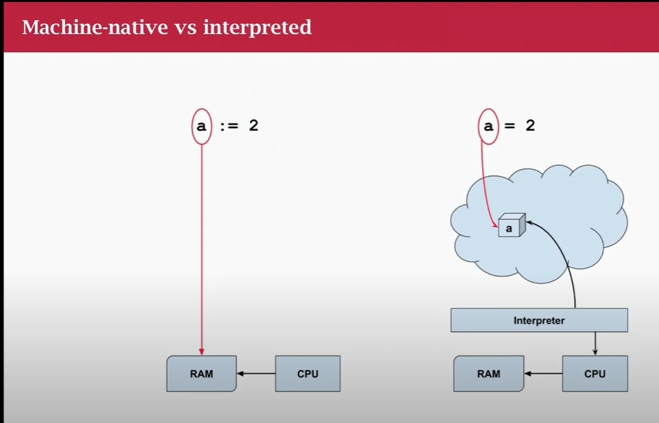

## Machine-native vs interpreted



- On the right handside represents a language like Python where the vairable is interprted as a
  number 2.
- Go works directly with machine numbers. There's no interpreter
- The Go compiler compiles to machine code and no interpration so it is faster.

## Integers

`int` is mostly the only number you will use and will be used based on accurace (e.g. decicaml point)

`float32` or `float64` used for floating point numbers to the level of accuracy needed for decimals.
Floats do not represent money well in Go, never completely accurate and rounding issues.

## Declarations

```
var a int

var (
    b = 2 // inferred as int
    f = 2.01 // inferred as float64
)
// declare multiple variables at the same time. Go will infer the types.


```

**Short declaration operator**

Reprsented like `:=` declares and assigns a value at the same time.

e.g.

`c := 2 // assigns 2 to c and infers type int`

## Printing the type of a variable

When using something like `fmt.Printf` you can do:

`fmt.Printf("a: %T %v\n", a, a)`
The %T will be printed as the _type_ of the variable.

## Simple Types

`bool` boolean, `true` or `false` obviously. Cannot convert from/ to integers.

`error` a special type with one function `Error()`. An error may be `nil` or `non-nil`

Pointers. An address of something. Physical addresses, logically opaque. A pointer may be `nil` or `non-nil`
If `nil` then not pointing at anything.

> There are no uninitialised variables go. They always have a "falsy" value, depending on the type. e.g. string "", bool false, int 0 etc

## constants

Numbers, strings and booleans can be constants. They are immutable.
