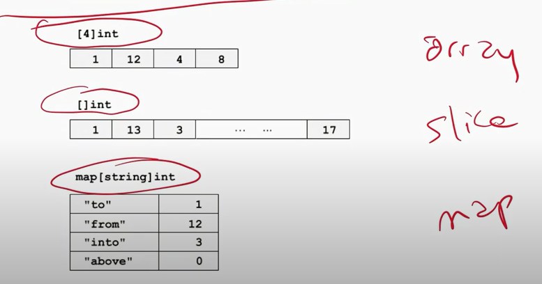

## Composite types

### Arrays

Fixed size/ length (fixed at compile time), represented by having a number defining how long it is: `[4]int`, e.g. `1, 12, 4, 8`

Not regularly used in Go.

Can be initialized semi dynamically. e.g. `var w := [...]{1,2,3}` is equivalient to `var w := [3]{1,2,3}`. It initalizes the length based on the number of values in the constructor.

> Arrays are passed by value, thus elements are copied.

### Slice

Dynamic length, represented by empty square brackers, e.g. `[]int`, e.g. `1,13,45,...87`

`var x = []int{0,0,0}`, represents an initalized slice

**Off-by-one bug**

SLices are indexed eg. `s[8:11]` where 8 is the starting element and 11 is one pass the ending element, this will have 3 (`11 - 8 = 3`) elements in the resulting slice. Therefore return elements at index 8, 9, 10.

> Slices are passed by reference, no copying, updating is OK

### Map

Key value pair. Defined by a key and then value, e.g. `map[string]int` is showing a map with a key of type string and then a value of type `int`

`car m map [string]int // nil, no storage`
`p := make(map[string]int) // non-nill, but empty`

> Maps are passed by reference, no copying, updating OK.

### Built ins

